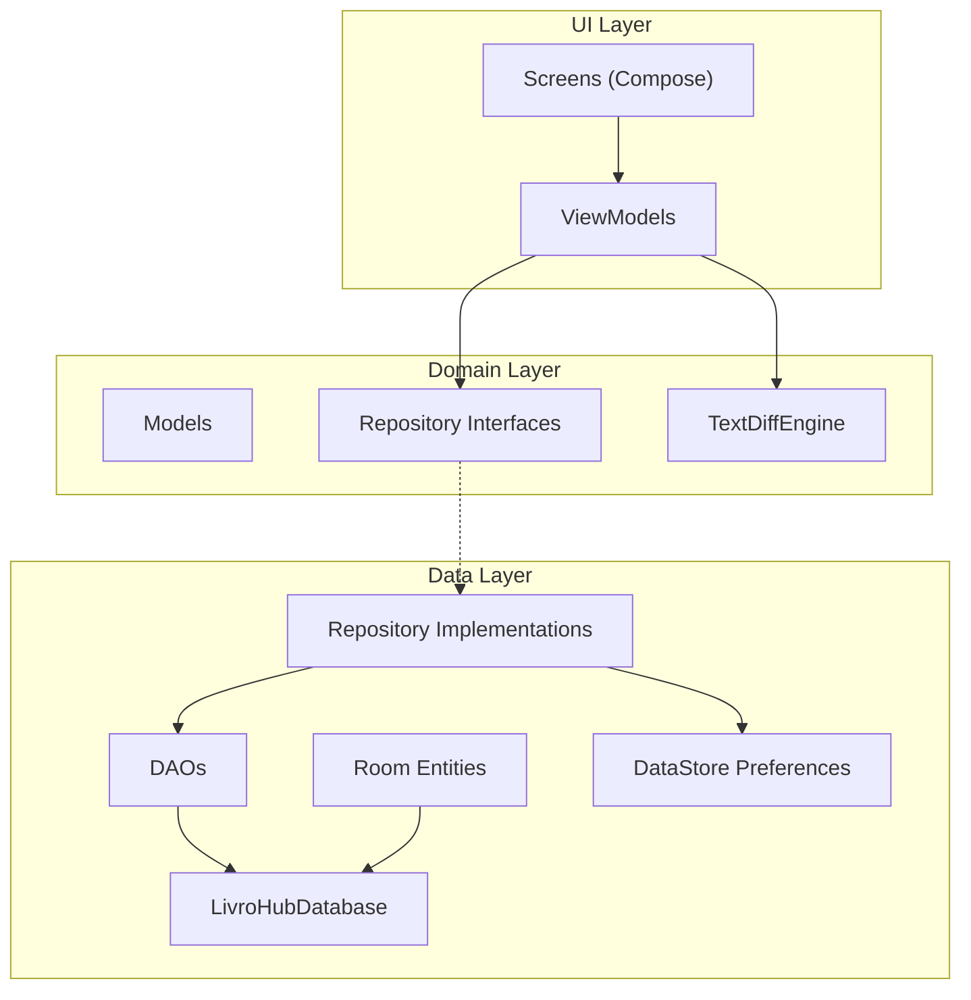
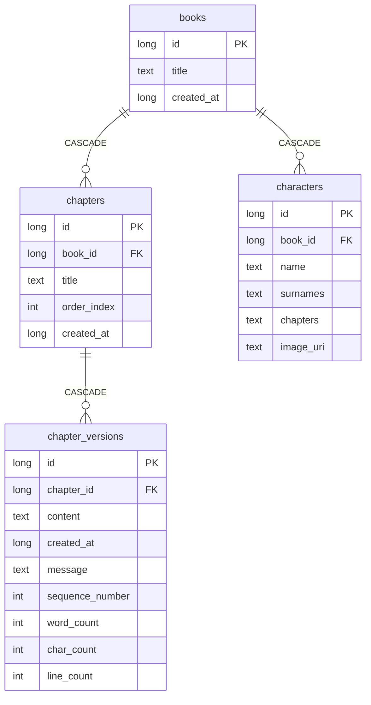

# LivroHub — Arquitetura do Sistema

## Visão Geral

LivroHub é um app Android offline, escrito em Kotlin + Jetpack Compose, que funciona como um "GitHub para livros". Permite criar livros, organizar capítulos, editar texto com versionamento completo, comparar diferenças entre versões e exportar conteúdo.

**Stack tecnológica**:

| Camada | Tecnologia |
|--------|-----------|
| Linguagem | Kotlin |
| UI | Jetpack Compose + Material 3 |
| Arquitetura | MVVM + Repository Pattern |
| Banco de dados | Room/SQLite |
| Preferências | DataStore Preferences |
| Diff | java-diff-utils (DiffRowGenerator) |
| Async | Coroutines + StateFlow |
| Imagens | Coil Compose |
| Min SDK | 24 |

---

## Diagrama de Camadas



---

## Mapa de Pacotes

```
com.livrohub/
├── LivroHubApp.kt              # Application: inicializa AppContainer
├── MainActivity.kt             # Activity: injeta repositórios no Compose
├── di/
│   └── AppContainer.kt         # DI manual: cria DB, DAOs, repositórios
├── data/
│   ├── local/
│   │   ├── LivroHubDatabase.kt # Room Database (v4)
│   │   ├── BookEntity.kt       # Entidade: livros
│   │   ├── BookDao.kt          # DAO: operações de livros + stats
│   │   ├── ChapterEntity.kt    # Entidade: capítulos
│   │   ├── ChapterDao.kt       # DAO: operações de capítulos
│   │   ├── ChapterVersionEntity.kt  # Entidade: versões imutáveis
│   │   ├── ChapterVersionDao.kt     # DAO: operações de versões
│   │   ├── CharacterEntity.kt  # Entidade: personagens
│   │   └── CharacterDao.kt     # DAO: operações de personagens
│   └── repository/
│       ├── OfflineBookRepository.kt      # Impl: livros
│       ├── OfflineChapterRepository.kt   # Impl: capítulos + versões
│       ├── OfflineCharacterRepository.kt # Impl: personagens
│       └── SettingsRepositoryImpl.kt     # Impl: DataStore
├── domain/
│   ├── model/
│   │   ├── Book.kt             # Modelo: livro
│   │   ├── BookWithStats.kt    # Modelo: livro + estatísticas
│   │   ├── Chapter.kt          # Modelo: capítulo
│   │   ├── ChapterVersion.kt   # Modelo: versão de capítulo
│   │   ├── Character.kt        # Modelo: personagem
│   │   └── AppSettings.kt      # Modelo: configurações + enum AppTheme
│   ├── repository/
│   │   ├── BookRepository.kt      # Interface: livros
│   │   ├── ChapterRepository.kt   # Interface: capítulos
│   │   ├── CharacterRepository.kt # Interface: personagens
│   │   └── SettingsRepository.kt  # Interface: configurações
│   └── diff/
│       └── TextDiffEngine.kt   # Motor de diff por palavra
└── ui/
    ├── LivroHubAppRoot.kt      # Composable raiz: tema + navegação
    ├── home/
    │   └── HomeScreen.kt       # Tela inicial
    ├── library/
    │   ├── LibraryScreen.kt    # Biblioteca de livros
    │   └── LibraryViewModel.kt
    ├── workspace/
    │   └── BookWorkspaceScreen.kt  # Workspace: abas capítulos/personagens
    ├── chapters/
    │   ├── ChaptersScreen.kt   # Lista de capítulos
    │   └── ChaptersViewModel.kt
    ├── characters/
    │   ├── CharactersScreen.kt # Catálogo de personagens
    │   └── CharacterViewModel.kt
    ├── editor/
    │   ├── EditorScreen.kt     # Editor de texto
    │   ├── EditorViewModel.kt
    │   └── MarkdownVisualTransformation.kt  # Highlight Markdown
    ├── diff/
    │   ├── DiffScreen.kt       # Tela de diff (dinâmico + estático)
    │   └── DiffViewModel.kt
    ├── history/
    │   ├── HistoryScreen.kt    # Histórico de versões
    │   └── HistoryViewModel.kt
    └── settings/
        ├── SettingsScreen.kt   # Configurações do app
        └── SettingsViewModel.kt
```

---

## Schema do Banco de Dados (v4)



**Índices**:
- `chapters(book_id)`
- `chapter_versions(chapter_id)`
- `chapter_versions(chapter_id, sequence_number)` UNIQUE
- `characters(book_id)`

---

## Fluxo de Dados

### Leitura (reativo)

```
Room DB → DAO (Flow) → Repository (map toDomain) → ViewModel (StateFlow) → Screen (collectAsStateWithLifecycle)
```

### Escrita

```
Screen → ViewModel (suspend) → Repository (suspend + withTransaction) → DAO (suspend) → Room DB
```

### Salvamento de Versão

1. Usuário toca "Salvar versão"
2. `EditorViewModel.saveVersion()` chamado
3. `ChapterRepository.saveVersion()` abre transação Room
4. Dentro da transação:
   - Calcula `nextSequence = MAX(sequence_number) + 1`
   - Calcula métricas (palavras, linhas, caracteres)
   - Insere nova `ChapterVersionEntity`
5. Flow reativo emite atualização
6. UI recompõe automaticamente

### Restauração de Versão

1. Usuário toca "Restaurar" no histórico
2. `HistoryViewModel.restoreVersion()` chama `saveVersion()` com o conteúdo antigo
3. Uma **nova versão** é criada (não altera/deleta nenhuma anterior)
4. Mensagem automática: "Restaurado da versao #X"

---

## Padrões e Decisões Técnicas

### MVVM + Repository
- **ViewModels** expõem `StateFlow` com UiState dedicado
- **Repositories** são interfaces no `domain` com implementações no `data`
- **Screens** são composables stateless que recebem estado e callbacks

### Injeção de Dependências Manual
- `AppContainer` instancia tudo no `onCreate()` do `Application`
- Sem Hilt/Dagger para manter a simplicidade nesta fase
- ViewModels usam `ViewModelProvider.Factory` customizadas

### Histórico Imutável
- Versões nunca são editadas ou deletadas
- Restauração cria nova versão (preserva trilha completa)
- Exclusão de livro/capítulo usa `CASCADE` para limpar versões

### Navegação Compose Simples
- Estado via `rememberSaveable` + enum `AppRoute`
- Sem Navigation Component (adequado para o número atual de telas)
- Sobrevive a rotação via `rememberSaveable`

### Performance
- Regex compilados como `companion object` constantes
- `DiffRowGenerator` compartilhado entre instâncias
- `TextStyle` e `VisualTransformation` memorizados com `remember`
- Métricas de texto pré-calculadas no salvamento (não em queries de leitura)
- `SharingStarted.WhileSubscribed(5_000)` para cancelar coleta quando tela não visível

### Dark Mode
- Cores de diff com paleta dedicada para dark e light mode (objeto `DiffColors`)
- Tema gerenciado via `AppTheme` enum + DataStore Preferences

---

## Como Continuar o Desenvolvimento

1. **Clonar/copiar** o projeto para a nova conta
2. Abrir no **Android Studio** (baixará dependências automaticamente)
3. Ler `HANDOFF.md` para o estado completo do sistema
4. Ler `PROGRESS.md` para o histórico de desenvolvimento
5. **Não recomece do zero** — o código está funcional e documentado
6. Manter etapas pequenas e atualizar a documentação após cada módulo
