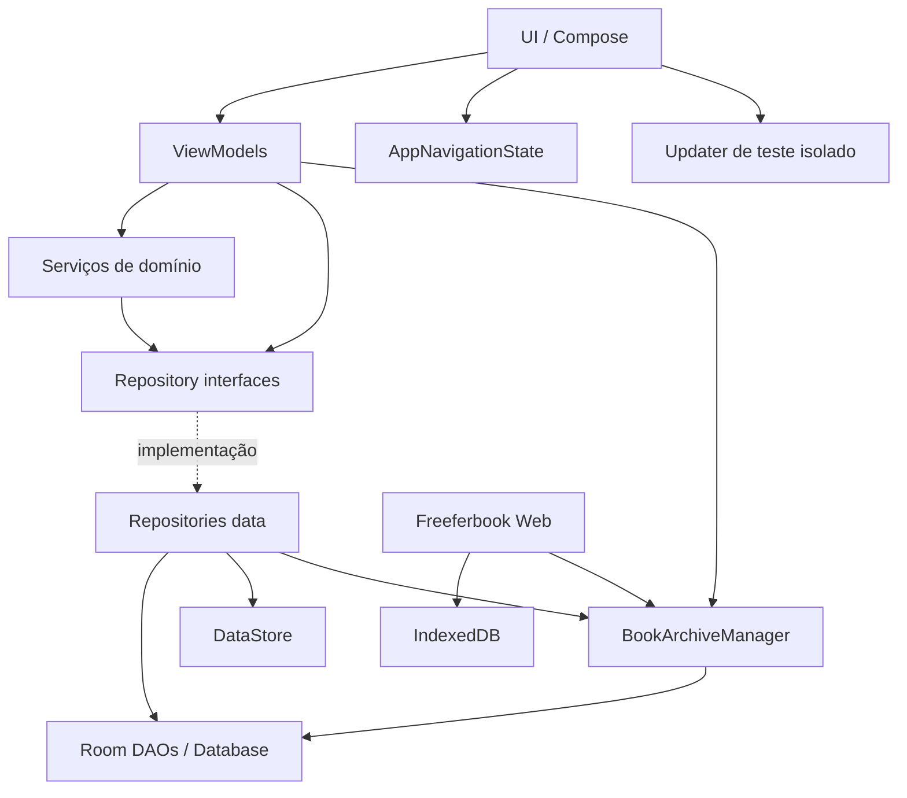
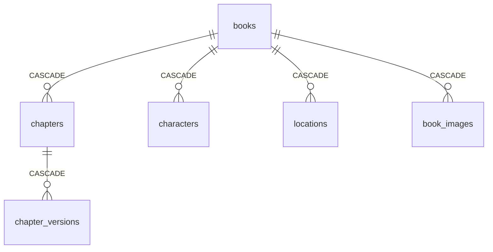

# Freeferbook / LivroHub — Arquitetura do Sistema

## Visão geral

Aplicativo Android nativo, offline-first, para escrita e organização de manuscritos. O código usa Kotlin, Jetpack Compose, Room, DataStore, Coroutines/StateFlow e uma camada de domínio explícita.

O repositório também contém o cliente `web/`, uma aplicação Web offline-first que usa IndexedDB e o mesmo contrato de backup do Android. A Web é publicada pelo mesmo workflow de release, mas ainda não compartilha binários Kotlin com o Android; a extração para Kotlin Multiplatform deve ocorrer de forma incremental depois que os contratos entre plataformas estiverem estabilizados.

Princípios atuais:

- estado de UI unidirecional;
- histórico de versões imutável;
- dependências por contratos, sem framework de DI;
- navegação tipada por estado;
- regras editoriais/worldbuilding fora dos Composables;
- recursos online opcionais e isolados do fluxo de escrita offline.

## Camadas



### UI

Responsável por composição, interação e coleta de estado. Screens não devem conter regras de persistência ou de domínio.

### ViewModels

Expõem `StateFlow` e coordenam ações da tela. A política padrão de compartilhamento está centralizada em `WhileUiSubscribed` (`5s`).

### Domain

Contém modelos, contratos de repositório e regras reutilizáveis, como:

- `TextDiffEngine`;
- `TextRevisionEngine`;
- `ChapterMentionSynchronizer`.

### Data

Implementações offline com Room/DataStore e serviços Android específicos, como o updater de APK de teste e o backup portátil de livros.

## Injeção de dependências

`AppContainer` implementa `AppDependencies`.

```text
LivroHubApp
  └─ AppContainer : AppDependencies
      ├─ BookRepository
      ├─ ChapterRepository
      ├─ CharacterRepository
      ├─ LocationRepository
      ├─ ImageRepository
      ├─ SettingsRepository
      ├─ ChapterMentionSynchronizer
      └─ BookArchiveManager
```

As dependências são `lazy`, então abrir a Home não força a criação/abertura do banco Room. `MainActivity` injeta apenas `AppDependencies` em `LivroHubAppRoot`, evitando aumentar a assinatura do composable raiz a cada novo serviço.

Para ViewModels parametrizados, usar:

```kotlin
viewModel(
    key = "editor-$chapterId",
    factory = viewModelFactory {
        EditorViewModel(...)
    }
)
```

Não criar uma classe `FooViewModelFactory` por ViewModel salvo quando houver necessidade específica de uma factory customizada.

## Navegação

A navegação permanece sem Navigation Component, mas é tipada e centralizada.

### Primeiro nível

`AppRoute`:

- `HOME`
- `LIBRARY`
- `SETTINGS`
- `BOOK_WORKSPACE`

### Dentro de um capítulo

`ChapterScreen`:

- `EDITOR`
- `PREVIEW`
- `REVISION`
- `HISTORY`
- `IMAGES`
- `DYNAMIC_DIFF`
- `STATIC_DIFF`

`AppNavigationState` é imutável. A mudança de rota ocorre por métodos como `openBook`, `openChapter`, `openChapterScreen` e `showStaticDiff`.

Isso elimina combinações inválidas que existiam quando histórico, imagens, revisão e preview eram controlados por `Boolean`s independentes.

### Persistência de navegação

O `Saver` guarda apenas estado pequeno: IDs e enums. Conteúdo de capítulos usado em diff é propositalmente transitório e não entra no `Bundle`, evitando `TransactionTooLargeException` em textos extensos.

## Escopo do editor

Existe uma única instância de `EditorViewModel` por `chapterId`. Editor, visão formatada e revisão compartilham essa instância, portanto alterações ainda não salvas sobrevivem à troca entre essas subtelas.

Ao salvar uma versão:

```text
EditorViewModel
  ├─ ChapterRepository.saveVersion()
  └─ ChapterMentionSynchronizer.synchronize()
       ├─ CharacterRepository
       └─ LocationRepository
```

O sincronizador de menções é um serviço de domínio independente. Novos tipos de worldbuilding devem ser adicionados nele (ou em serviços equivalentes), e não diretamente no ViewModel do editor.

## Banco de dados

Room schema atual: **v6**.

Entidades:

- `BookEntity`
- `ChapterEntity`
- `ChapterVersionEntity`
- `CharacterEntity`
- `LocationEntity`
- `ImageEntity`

Relação principal:



`OfflineBookRepository` recebe `BookDao` diretamente em vez do `RoomDatabase`, reduzindo acoplamento e permitindo teste unitário sem Android/Room real.

### Dívida técnica crítica

`AppContainer` ainda usa `fallbackToDestructiveMigration()`. Antes de distribuir versões que alterem schema para usuários reais, substituir por migrations explícitas e testadas. Dados de manuscritos não devem depender de migração destrutiva.

## Atualização de builds de teste

O updater é separado das preferências visuais:

```text
SettingsScreen
  └─ TestUpdateSection
      └─ TestUpdateViewModel
          └─ TestUpdateManager
```

`TestUpdateViewModel` mantém estado de verificação/download/instalação entre mudanças de configuração. `SettingsScreen` não manipula rede ou arquivos APK diretamente.

O canal público de testes usa o package `com.livrohub.test`, separado do app local `com.livrohub`.

Ao iniciar `com.livrohub.test`, `StartupUpdatePrompt` executa uma única consulta silenciosa por sessão. Se houver uma versão mais nova, oferece `Atualizar agora` ou `Depois`. Erros de rede no startup não bloqueiam nem exibem alerta; a verificação manual em Configurações continua disponível.

## Freeferbook Web

O cliente Web fica em `web/` e é deliberadamente buildless nesta primeira fase: HTML, CSS e módulos JavaScript são servidos diretamente pelo GitHub Pages. Isso reduz o ciclo de feedback enquanto a plataforma ainda está sendo validada.

Persistência:

```text
UI Web
  -> IndexedDB (freeferbook-web/projects)
      -> livro completo
          -> capítulos
          -> rascunhos
          -> versões
          -> personagens/locais/imagens
          -> blobs de mídia importados
```

O navegador guarda os dados localmente. Não há sincronização em nuvem nesta fase; para mover conteúdo entre Android/Web, usar o backup compatível.

Preferências Web ficam separadas dos projetos em `localStorage` (`freeferbook-web-settings-v1`). Elas controlam apenas apresentação/comportamento local do navegador e não entram no backup do livro. As categorias seguem o mesmo agrupamento conceitual do Android (`Aparência`, `Funcionalidades`, `Extras`) e iniciam recolhidas.

No editor Web, números de linha são derivados das quebras reais do rascunho e o gutter acompanha o `scrollTop` do `textarea`. Tema, tamanho do texto, altura de linha, visibilidade de Personagens/Locais e redução de movimento são aplicados via atributos/CSS custom properties, sem recarregar a aplicação.

Contrato de interoperabilidade atual:

```text
freeferbook-book-backup
schemaVersion = 1
  ├─ manifest.json
  └─ media/*
```

Android e Web devem tratar esse formato como contrato versionado. Mudanças incompatíveis exigem novo `schemaVersion` e leitores retrocompatíveis sempre que possível.

O importador Web lê ZIP STORE e DEFLATE. A exportação Web usa ZIP STORE para não depender de bibliotecas JavaScript externas e continua compatível com `ZipFile`/`ZipOutputStream` do Android.

### Formatação Markdown na Web

A regra de edição Markdown Web fica em `web/js/formatting.js`, separada da DOM/UI. Ela replica os formatos usados pelo Android: negrito, itálico, riscado, sublinhado, destaque, H3, citação, lista com marcadores, lista numerada, checklist e marcadores personalizados `•`, `→`, `★`, `✓`, `◆`.

Formatos inline preservam a seleção apenas sobre o conteúdo. Formatos de lista substituem prefixos já reconhecidos em vez de acumulá-los, permitindo conversão direta entre lista numerada, checklist, bullet e marcador customizado.

`scripts/test-web-formatting.mjs` cobre a regra pura e roda no GitHub Actions antes do build Android. A integração visual permanece em `app.js`, que captura `selectionStart`/`selectionEnd`, aplica o resultado e devolve foco/seleção ao `textarea`.

### Release conjunta Android + Web

O workflow `.github/workflows/android-test-release.yml` produz, no mesmo commit:

```text
GitHub push main
  -> APK com.livrohub.test
  -> update.json
  -> web-version.json
  -> web/**
  -> GitHub Pages
  -> release test-latest
```

`web-version.json` e `update.json` permitem conferir no próprio site se Web e Android pertencem ao mesmo ciclo de release.

## Backup completo de livros

`BookArchiveManager` implementa importação/exportação de um livro inteiro sem alterar o schema Room.

Formato atual:

```text
backup.zip
├─ manifest.json
└─ media/
   └─ ... imagens locais acessíveis no momento da exportação
```

O `manifest.json` usa `format = freeferbook-book-backup` e `schemaVersion = 1`. O número da versão do formato é independente da versão do banco Room e deve ser incrementado somente quando o contrato do backup mudar de forma incompatível.

O contrato possui uma fixture canônica em `contracts/book-backup-v1.sample.json`. O script `scripts/validate-backup-contract.mjs` é executado no GitHub Actions e verifica simultaneamente:

- `FORMAT_ID` e `SCHEMA_VERSION` do Android;
- `FORMAT_ID` e `SCHEMA_VERSION` da Web;
- estrutura mínima da fixture;
- round-trip Web → ZIP → Web usando o mesmo contrato.

Esse teste deve falhar antes do build quando uma plataforma mudar o formato sem atualizar as demais.

O backup inclui:

- livro e timestamp original;
- capítulos e ordem;
- todas as versões salvas de cada capítulo;
- personagens;
- locais;
- imagens de referência;
- cópia de mídia local quando o Android ainda consegue abrir a URI.

Na importação, IDs são regenerados e as relações internas reconstruídas dentro de uma transação. O livro importado nunca sobrescreve outro livro existente. Entradas de mídia só são lidas do namespace `media/`, com limites de tamanho, evitando extração arbitrária de caminhos do ZIP.

ZIP é o formato de contêiner suportado. Uma extensão customizada pode ser usada desde que o conteúdo continue sendo ZIP. RAR/7z são detectados e rejeitados explicitamente em vez de serem interpretados como backup válido.

## Fluxos reativos

Padrão de leitura:

```text
Room/DataStore Flow
  → Repository
  → ViewModel StateFlow
  → collectAsStateWithLifecycle()
```

Para `stateIn`, usar `WhileUiSubscribed`, definido em `ui/common/ViewModelSupport.kt`, em vez de repetir timeouts numéricos.

## Testes

`testDebugUnitTest` é a validação unitária padrão e deve permanecer executável.

Cobertura atual inclui:

- repositório de livros;
- diff de texto;
- revisão textual;
- formatação Markdown;
- navegação tipada;
- sincronização de menções de worldbuilding.

Ao adicionar regra de domínio, preferir dependências injetáveis (DAO/repository/clock) para que o teste não precise subir Android/Room.

## Organização de pacotes relevante

```text
com.livrohub/
├─ di/
│  ├─ AppDependencies.kt
│  └─ AppContainer.kt
├─ data/
│  ├─ archive/
│  ├─ local/
│  ├─ repository/
│  └─ update/
├─ domain/
│  ├─ diff/
│  ├─ model/
│  ├─ repository/
│  ├─ revision/
│  └─ worldbuilding/
└─ ui/
   ├─ common/
   ├─ navigation/
   ├─ editor/
   ├─ preview/
   ├─ revision/
   ├─ history/
   ├─ settings/
   │  └─ update/
   └─ ...

web/
├─ index.html
├─ styles.css
├─ manifest.webmanifest
└─ js/
   ├─ app.js
   ├─ db.js
   ├─ formatting.js
   ├─ markdown.js
   └─ archive.js

contracts/
└─ book-backup-v1.sample.json

scripts/
├─ validate-backup-contract.mjs
└─ test-web-formatting.mjs
```

## Regras para novas implementações

1. Nova tela de capítulo: adicionar uma entrada em `ChapterScreen` e um branch em `ChapterRoute`; não criar novos booleanos paralelos.
2. Nova dependência global: adicionar ao `AppDependencies` e inicializar `lazy` no `AppContainer`.
3. Nova regra de negócio: preferir `domain/` e injetá-la no ViewModel; não colocá-la em Composable.
4. Novo ViewModel parametrizado: usar `viewModelFactory { ... }` e chave estável.
5. Novo `StateFlow.stateIn`: usar `WhileUiSubscribed`.
6. Dados grandes/transitórios: não salvar em `rememberSaveable`/Bundle.
7. Mudança de banco: criar migration Room explícita e teste de migration antes de incrementar schema.
8. Feature online: manter opt-in e desacoplada das funções de escrita/biblioteca offline.
9. Toda refatoração relevante deve fechar com `testDebugUnitTest` + `assembleDebug`.
10. Alterações no formato de backup devem ser implementadas/testadas em Android e Web antes de incrementar `schemaVersion`.
11. A futura versão Desktop deve entrar somente depois de estabilizar os contratos Web/Android; priorizar extração gradual de regras puras para Kotlin Multiplatform, não uma migração total de uma vez.
12. Mudança no formato de backup: manter compatibilidade retroativa quando possível e atualizar a fixture/validador junto da implementação.
13. Configurações específicas da Web não devem alterar silenciosamente o contrato de backup; preferências de navegador permanecem locais salvo quando houver um contrato multiplataforma explícito.
14. Regra de formatação Web deve permanecer em módulo puro/testável; eventos de DOM, foco e seleção ficam em `app.js`.
