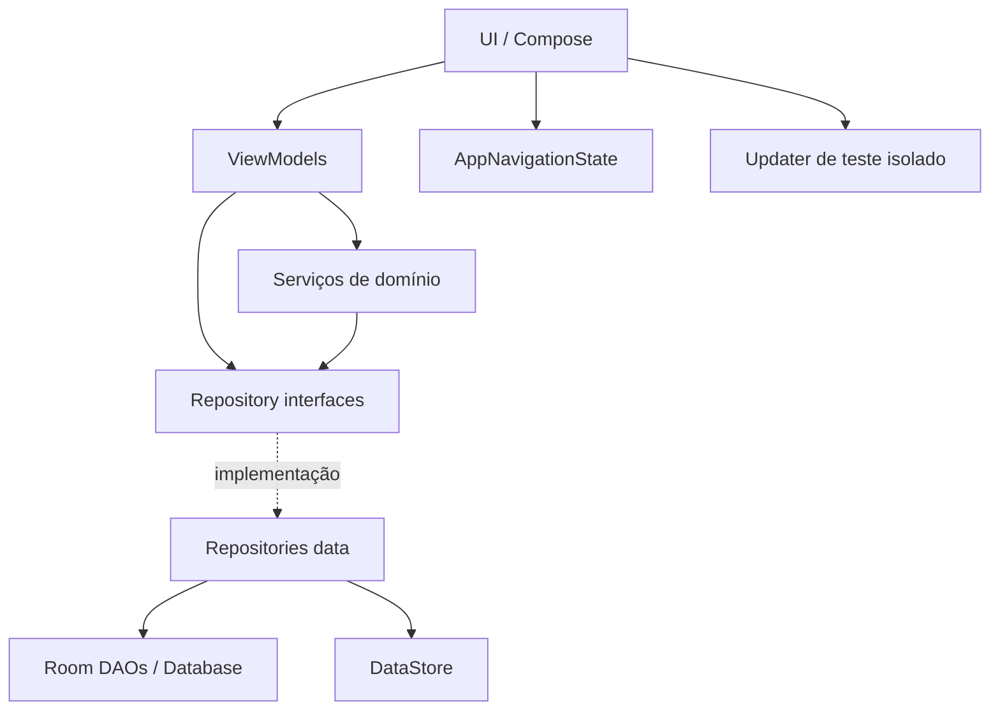
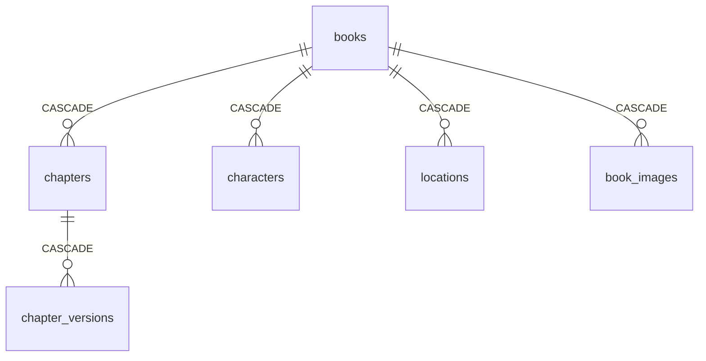

# Freeferbook / LivroHub — Arquitetura do Sistema

## Visão geral

Aplicativo Android nativo, offline-first, para escrita e organização de manuscritos. O código usa Kotlin, Jetpack Compose, Room, DataStore, Coroutines/StateFlow e uma camada de domínio explícita.

Princípios atuais:

- estado de UI unidirecional;
- histórico de versões imutável;
- dependências por contratos, sem framework de DI;
- navegação tipada por estado;
- regras editoriais/worldbuilding fora dos Composables;
- recursos online opcionais e isolados do fluxo de escrita offline.

## Camadas



### UI

Responsável por composição, interação e coleta de estado. Screens não devem conter regras de persistência ou de domínio.

### ViewModels

Expõem `StateFlow` e coordenam ações da tela. A política padrão de compartilhamento está centralizada em `WhileUiSubscribed` (`5s`).

### Domain

Contém modelos, contratos de repositório e regras reutilizáveis, como:

- `TextDiffEngine`;
- `TextRevisionEngine`;
- `ChapterMentionSynchronizer`.

### Data

Implementações offline com Room/DataStore e serviços Android específicos, como o updater de APK de teste.

## Injeção de dependências

`AppContainer` implementa `AppDependencies`.

```text
LivroHubApp
  └─ AppContainer : AppDependencies
      ├─ BookRepository
      ├─ ChapterRepository
      ├─ CharacterRepository
      ├─ LocationRepository
      ├─ ImageRepository
      ├─ SettingsRepository
      └─ ChapterMentionSynchronizer
```

As dependências são `lazy`, então abrir a Home não força a criação/abertura do banco Room. `MainActivity` injeta apenas `AppDependencies` em `LivroHubAppRoot`, evitando aumentar a assinatura do composable raiz a cada novo serviço.

Para ViewModels parametrizados, usar:

```kotlin
viewModel(
    key = "editor-$chapterId",
    factory = viewModelFactory {
        EditorViewModel(...)
    }
)
```

Não criar uma classe `FooViewModelFactory` por ViewModel salvo quando houver necessidade específica de uma factory customizada.

## Navegação

A navegação permanece sem Navigation Component, mas é tipada e centralizada.

### Primeiro nível

`AppRoute`:

- `HOME`
- `LIBRARY`
- `SETTINGS`
- `BOOK_WORKSPACE`

### Dentro de um capítulo

`ChapterScreen`:

- `EDITOR`
- `PREVIEW`
- `REVISION`
- `HISTORY`
- `IMAGES`
- `DYNAMIC_DIFF`
- `STATIC_DIFF`

`AppNavigationState` é imutável. A mudança de rota ocorre por métodos como `openBook`, `openChapter`, `openChapterScreen` e `showStaticDiff`.

Isso elimina combinações inválidas que existiam quando histórico, imagens, revisão e preview eram controlados por `Boolean`s independentes.

### Persistência de navegação

O `Saver` guarda apenas estado pequeno: IDs e enums. Conteúdo de capítulos usado em diff é propositalmente transitório e não entra no `Bundle`, evitando `TransactionTooLargeException` em textos extensos.

## Escopo do editor

Existe uma única instância de `EditorViewModel` por `chapterId`. Editor, visão formatada e revisão compartilham essa instância, portanto alterações ainda não salvas sobrevivem à troca entre essas subtelas.

Ao salvar uma versão:

```text
EditorViewModel
  ├─ ChapterRepository.saveVersion()
  └─ ChapterMentionSynchronizer.synchronize()
       ├─ CharacterRepository
       └─ LocationRepository
```

O sincronizador de menções é um serviço de domínio independente. Novos tipos de worldbuilding devem ser adicionados nele (ou em serviços equivalentes), e não diretamente no ViewModel do editor.

## Banco de dados

Room schema atual: **v6**.

Entidades:

- `BookEntity`
- `ChapterEntity`
- `ChapterVersionEntity`
- `CharacterEntity`
- `LocationEntity`
- `ImageEntity`

Relação principal:



`OfflineBookRepository` recebe `BookDao` diretamente em vez do `RoomDatabase`, reduzindo acoplamento e permitindo teste unitário sem Android/Room real.

### Dívida técnica crítica

`AppContainer` ainda usa `fallbackToDestructiveMigration()`. Antes de distribuir versões que alterem schema para usuários reais, substituir por migrations explícitas e testadas. Dados de manuscritos não devem depender de migração destrutiva.

## Atualização de builds de teste

O updater é separado das preferências visuais:

```text
SettingsScreen
  └─ TestUpdateSection
      └─ TestUpdateViewModel
          └─ TestUpdateManager
```

`TestUpdateViewModel` mantém estado de verificação/download/instalação entre mudanças de configuração. `SettingsScreen` não manipula rede ou arquivos APK diretamente.

O canal público de testes usa o package `com.livrohub.test`, separado do app local `com.livrohub`.

## Fluxos reativos

Padrão de leitura:

```text
Room/DataStore Flow
  → Repository
  → ViewModel StateFlow
  → collectAsStateWithLifecycle()
```

Para `stateIn`, usar `WhileUiSubscribed`, definido em `ui/common/ViewModelSupport.kt`, em vez de repetir timeouts numéricos.

## Testes

`testDebugUnitTest` é a validação unitária padrão e deve permanecer executável.

Cobertura atual inclui:

- repositório de livros;
- diff de texto;
- revisão textual;
- formatação Markdown;
- navegação tipada;
- sincronização de menções de worldbuilding.

Ao adicionar regra de domínio, preferir dependências injetáveis (DAO/repository/clock) para que o teste não precise subir Android/Room.

## Organização de pacotes relevante

```text
com.livrohub/
├─ di/
│  ├─ AppDependencies.kt
│  └─ AppContainer.kt
├─ data/
│  ├─ local/
│  ├─ repository/
│  └─ update/
├─ domain/
│  ├─ diff/
│  ├─ model/
│  ├─ repository/
│  ├─ revision/
│  └─ worldbuilding/
└─ ui/
   ├─ common/
   ├─ navigation/
   ├─ editor/
   ├─ preview/
   ├─ revision/
   ├─ history/
   ├─ settings/
   │  └─ update/
   └─ ...
```

## Regras para novas implementações

1. Nova tela de capítulo: adicionar uma entrada em `ChapterScreen` e um branch em `ChapterRoute`; não criar novos booleanos paralelos.
2. Nova dependência global: adicionar ao `AppDependencies` e inicializar `lazy` no `AppContainer`.
3. Nova regra de negócio: preferir `domain/` e injetá-la no ViewModel; não colocá-la em Composable.
4. Novo ViewModel parametrizado: usar `viewModelFactory { ... }` e chave estável.
5. Novo `StateFlow.stateIn`: usar `WhileUiSubscribed`.
6. Dados grandes/transitórios: não salvar em `rememberSaveable`/Bundle.
7. Mudança de banco: criar migration Room explícita e teste de migration antes de incrementar schema.
8. Feature online: manter opt-in e desacoplada das funções de escrita/biblioteca offline.
9. Toda refatoração relevante deve fechar com `testDebugUnitTest` + `assembleDebug`.
