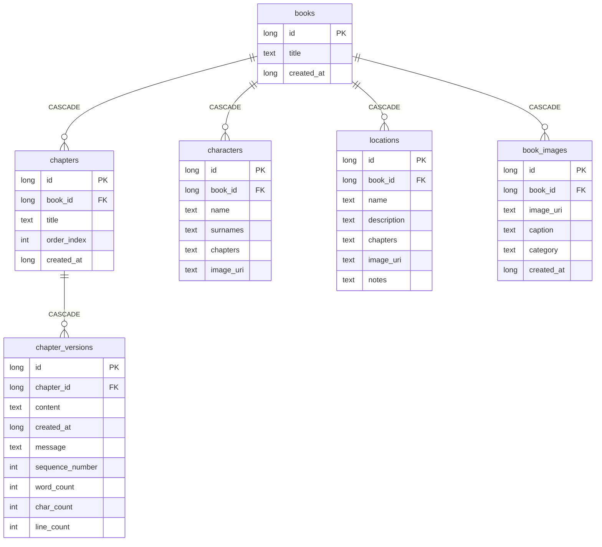

# LivroHub — Relatório Consolidado do Projeto

> **Versão do Documento:** 1.0  
> **Data:** Setembro de 2026  
> **Repositório:** `TomikantGit/Freeferbook2`  
> **Status:** Código funcional, versionado, documentado e pronto para compilação.

---

## 1. Visão Geral do Projeto

O **LivroHub** é um aplicativo Android nativo, **100% offline**, construído em **Kotlin** e **Jetpack Compose (Material 3)**. Ele atua como um *"GitHub para livros e manuscritos"*, permitindo que autores gerenciem a produção de suas obras com um fluxo profissional de controle de versão imutável, *worldbuilding*, escrita assistida por Markdown e múltiplos formatos de publicação.

### Proposta de Valor
- **Histórico Estritamente Imutável:** Versões salvas nunca são sobrescritas nem deletadas.
- **Restauração Segura:** Restaurar uma versão antiga cria uma nova versão (`#N+1`), mantendo todo o registro histórico anterior intacto.
- **Comparação Visual (Diff):** Destaque de alterações palavra por palavra em tempo real ou entre versões salvas.
- **Worldbuilding Integrado:** Fichas de personagens, cenários/locais e galeria de referências visuais vinculadas ao livro.
- **Exportação Profissional:** Publicação direta do app em formatos TXT, Markdown (.md), PDF formatado (A4) e EPUB compatível com e-readers.

---

## 2. Stack Tecnológica

| Camada | Tecnologia | Detalhes |
|---|---|---|
| **Linguagem** | Kotlin 1.9+ | Target JVM 17 |
| **Interface (UI)** | Jetpack Compose + Material 3 | Compose BOM, Design Tokens customizados |
| **Arquitetura** | MVVM + Repository Pattern | Unidirectional Data Flow (UDF), StateFlow |
| **Banco de Dados Local** | Room / SQLite (KSP) | Schema v6, integridade referencial com `CASCADE` |
| **Preferências do App** | Jetpack DataStore Preferences | Temas, tipografia e preferências de escrita |
| **Motor de Diff** | `java-diff-utils` | Comparação de texto e realce palavra por palavra |
| **Carregamento de Imagens** | Coil Compose | Fotos de personagens, locais e referências |
| **Compatibilidade** | `minSdk = 24` / `targetSdk = 35` | Android 7.0 (Nougat) até Android 15 |

---

## 3. Evolução Funcional

O histórico público é mantido sem referências ao histórico privado de desenvolvimento. A evolução funcional do projeto pode ser resumida pelas fases abaixo.

### Resumo das Fases:
1. **Fase 1 — Fundação e Biblioteca:**
   - Configuração do Gradle com KSP, Room e Jetpack Compose.
   - Banco SQLite offline e Repositório desacoplado (`OfflineBookRepository`).
   - Interface de biblioteca com listagem, criação, renomeação e exclusão de livros.
   - Editor de texto em tela cheia com salvamento de versões e cálculo de número sequencial.
   - Primeira versão do `TextDiffEngine` e da `HistoryScreen` com exportação SAF (.txt/.md).
   - Testes unitários para repositório e motor de diff.

2. **Fase 2 — Preferências do Usuário:**
   - Integração com Jetpack DataStore Preferences.
   - `SettingsScreen` com controle de temas (claro/escuro/sistema), tamanho de fonte e numeração de linhas.

3. **Fase 3 — Refatoração por Capítulos & Personagens:**
   - Granularidade de versão reestruturada: versionamento transferido do nível do livro para o nível do **capítulo**.
   - Criação do `BookWorkspaceScreen` com abas para capítulos e fichas de personagens.
   - Fichas de personagens com nome, sobrenomes, capítulos de menção e foto via Photo Picker.
   - Highlight sintático Markdown em tempo real no editor (`MarkdownVisualTransformation`).
   - Destaque colorido inline de palavras no diff (`AnnotatedString` verde/vermelho).
   - Otimizações de performance (memoização e `companion object` para regex).
   - Documentação extensiva de arquitetura (`ARCHITECTURE.md` e `HANDOFF.md`).

4. **Fase 4 — Worldbuilding Avançado, Design System e Publicação:**
   - Módulo de **Locais & Cenários** com descrição, capítulos vinculados, notas e imagens.
   - Módulo de **Galeria de Referências Visuais** em grid para mapas, conceitos e inspirações.
   - Exportadores completos: **PDF** (layout A4 paginado) e **EPUB** (e-book padrão com XML, OPF, NCX e XHTML).
   - Design System completo com **20 temas visuais** e seleção tipográfica (incluindo OpenDyslexic).
   - Sistema de **Tutoriais Interativos (Onboarding)** com overlay contextual destacando botões.
   - Schema do banco Room atualizado para a versão 6.

---

## 4. Funcionalidades Implementadas

### 4.1. Gestão de Livros e Biblioteca
- Listagem em cards com título e métricas em tempo real (total de capítulos, palavras, linhas e caracteres).
- Criação rápida com capítulo inicial automático.
- Diálogos de confirmação para renomear e excluir livros (com exclusão em cascata).

### 4.2. Workspace da Obra
- Navegação fluida entre abas:
  - **Capítulos:** ordenação sequencial e status de escrita.
  - **Personagens:** ficha completa com foto, descrição e capítulos de aparição.
  - **Locais:** catálogo de ambientações, reinos, cidades e notas de cenários.
  - **Imagens:** galeria de mapas e referências visuais com legendas.

### 4.3. Editor de Texto Focado
- Barra de formatação Markdown rápida (Negrito, Itálico, Riscado, Títulos H1/H2, Citações).
- Realce de sintaxe em tempo real no campo de digitação.
- Numeração de linhas lateral opcional.
- Indicador visual de alterações não salvas.
- Diálogo de salvamento com mensagem explicativa da versão.

### 4.4. Motor de Diff e Comparação
- **Diff Dinâmico:** compara as alterações em tempo real no editor com a última versão salva.
- **Diff Estático:** seleciona quaisquer duas versões no histórico para ver a evolução do texto.
- Destaque palavra por palavra com cores de alto contraste (verde para adições, vermelho para remoções).

### 4.5. Histórico e Restauração
- Linha do tempo de versões em ordem decrescente com data, hora, autor da versão e métricas de texto.
- Restauração de qualquer versão antiga gerando uma nova entrada sequencial sem perda de dados anteriores.

### 4.6. Exportação Multi-Formato
- **TXT / Markdown (.md):** arquivos de texto puro legíveis em qualquer plataforma.
- **PDF:** documento A4 com cabeçalho, tipografia serifada, quebras de página automáticas e formatação Markdown processada.
- **EPUB:** livro digital pronto para leitura em dispositivos Kindle, Kobo ou apps de leitura.

### 4.7. Design System & Acessibilidade
- 20 temas de cores: Modern Light/Dark, AMOLED, Minimal, Cyberpunk, Synthwave, Nord, Dracula, Catppuccin, Forest, Sunset, etc.
- Famílias de fontes: Inter, Geist, Roboto, SF Pro, IBM Plex Sans, Nunito, Poppins e OpenDyslexic (para dislexia).
- Ajustes de entrelinha, espaçamento entre caracteres e densidade de tela.
- Overlay de tutorial na primeira execução para guiar o usuário pelas ações principais.

---

## 5. Schema do Banco de Dados (Room v6)



---

## 6. Estrutura de Arquivos do Projeto

```
papel-voc-um-a-desenvolvedor-a/
├── app/
│   ├── schemas/                          # Schemas do Room (1.json até 6.json)
│   └── src/
│       ├── main/
│       │   ├── AndroidManifest.xml
│       │   └── java/com/livrohub/
│       │       ├── LivroHubApp.kt         # Application class e AppContainer
│       │       ├── MainActivity.kt        # Activity única
│       │       ├── di/AppContainer.kt     # Injeção manual de dependências
│       │       ├── data/local/            # Entidades Room e DAOs
│       │       ├── data/repository/       # Repositórios locais Room/DataStore
│       │       ├── domain/diff/           # Motor TextDiffEngine
│       │       ├── domain/model/          # Modelos de domínio (Book, Chapter, etc.)
│       │       ├── domain/repository/     # Interfaces de repositório
│       │       ├── ui/
│       │       │   ├── LivroHubAppRoot.kt # Roteamento e orquestração de telas
│       │       │   ├── home/              # HomeScreen
│       │       │   ├── library/           # LibraryScreen & ViewModel
│       │       │   ├── workspace/         # BookWorkspaceScreen
│       │       │   ├── chapters/          # ChaptersScreen & ViewModel
│       │       │   ├── characters/        # CharactersScreen & ViewModel
│       │       │   ├── locations/         # LocationsScreen & ViewModel
│       │       │   ├── images/            # ImagesScreen & ViewModel
│       │       │   ├── editor/            # EditorScreen, Markdown transformation
│       │       │   ├── diff/              # DiffScreen & StaticDiffScreen
│       │       │   ├── history/           # HistoryScreen & ViewModel
│       │       │   ├── settings/          # SettingsScreen & ViewModel
│       │       │   ├── components/        # Componentes reutilizáveis e TutorialOverlay
│       │       │   └── theme/             # Design Tokens, 20 Temas e Tipografia
│       │       └── utils/                 # PdfExporter, EpubExporter, MarkdownParser
│       └── test/                         # Testes unitários (Repositório e Diff)
├── ARCHITECTURE.md                       # Detalhamento de arquitetura
├── HANDOFF.md                            # Guia de continuidade do projeto
├── PROGRESS.md                           # Log cronológico de progresso
└── local.properties                      # Caminho do Android SDK configurado
```

---

## 7. Status do Ambiente e Próximos Passos

- **Git:** Branch `main` sincronizada com `origin/main`, com a árvore de trabalho limpa (`working tree clean`).
- **Android SDK:** Configurado localmente por `local.properties`, arquivo ignorado pelo Git e específico de cada ambiente de desenvolvimento.
- **Compilação:** O projeto está pronto para abertura e build no Android Studio via `./gradlew assembleDebug`.

### Melhorias Futuras Recomendadas:
1. **Reordenação Drag & Drop:** suporte a arrastar para reordenar capítulos no workspace.
2. **Busca Global Textual:** pesquisa rápida por termos em todos os capítulos do livro.
3. **Importação:** importador de arquivos externos (.txt, .md, .docx) para criação automática de capítulos.
4. **Migrações Manuais do Room:** adicionar migrações incrementais do Room para preservar dados de instalações prévias.
